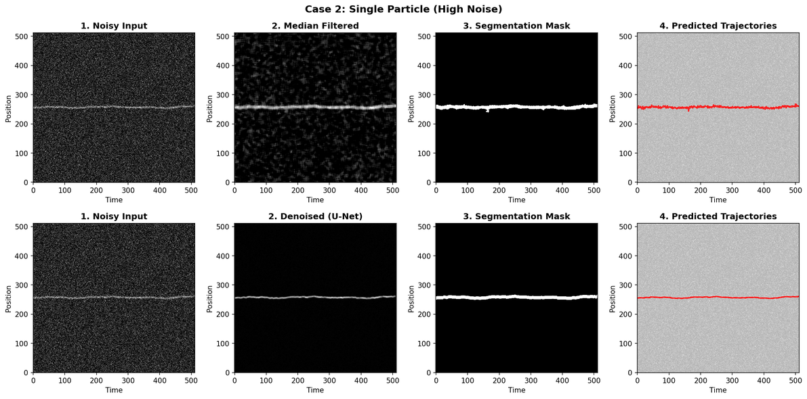

# Kymo-Tracker: Multi-Particle Kymograph Denoising and Tracking

## Problem Description

Kymograph particle tracking is essential for nanofluidic scattering microscopy of lipid nanoparticles (10-100 nm). In commercial setups, compromises are made on the laser source compared to academic setups, thus sacrificing the signal-to-noise ratio.

The problem can be modeled as follows:

1. **Particle trajectory simulation**: Given a particle radius and the corresponding diffusion coefficient, the particle trajectory can be simulated. The particle undergoes Brownian motion (assuming no drift due to pressure gradient).

2. **Gaussian blur**: The trajectory is blurred by a Gaussian filter to account for the finite particle size. The trajectory can be described by the distribution `p(x,t)`:
   - Before blurring: binary (0 or 1)
   - After blurring: continuous values from 0 to 1

3. **Noise mixing**: The blurred trajectory is mixed with white noise `n(x,t) = Gaussian(n₀, σ)`, where we assume `n₀ = 0`. The mixing is achieved with weights:
   - `contrast` for the signal
   - `noise_level` for the noise

### The Inverse Problem

The core challenge is to derive the true trajectory for each particle appearing in the kymograph from the mixed noisy signal. This is an inverse problem of the noise mixing process.

**High signal-to-noise ratio approach**: At high SNR, one can find the maximum intensity position `x` for each time `t`, and fit a parabola with two next neighbors to refine the position estimate.

**Diffusion law fitting**: With the true trajectory, we can fit the diffusion law for Brownian motion:

```
<(Δx)²> = 2D(Δt)
```

where we sample `Δx` and `Δt` from the trajectory at different timepoints and time distances. From the fitted diffusion coefficient `D`, we can calculate the particle size using the Stokes-Einstein equation.

All of the above classical methods are well-coded in [`helpers.py`](src/kymo_tracker/utils/helpers.py), including trajectory fitting, MSD (mean squared displacement) calculation, and particle size estimation from diffusion coefficients.

### Classical Solution: Median Filtering

The problem reduces to extracting the trajectory `p(x,t) = {0,1}` for each particle. The `argmax` approach struggles at low signal-to-noise ratios because noise can sometimes exceed the signal intensity. However, noise fluctuates more frequently locally than the Gaussian-filtered trajectory.

A natural solution is to use a **median filter** as a low-pass filter in the position space. We apply a `(5,1)` kernel—5 pixels in the position space and 1 pixel in the time space—to suppress high-frequency noise while preserving the slower-varying particle trajectory.

This median filtering approach works well up to `contrast/noise_level > 2` and provides good predictions for diffusion coefficient and particle size on simulated data.

**Limitation**: Intuitively, one might increase the kernel size to achieve better denoising results. However, we have found that as the kernel size increases—either in the position space (e.g., `(11,1)`) or time space (e.g., `(5,5)`)—the diffusion coefficient calculation no longer works robustly. The larger kernel blurs the high frequencies required for Brownian motion analysis, thus lowering the temporal resolution and making the integration of high-speed camera data useless. This creates a fundamental trade-off between noise suppression and temporal resolution preservation.

### Deep Learning Approach: Diffusion Models

Given that this is an inverse problem, we explored common computer vision inverse problem techniques. **Diffusion models (DDPM)** reconstruct images from pure Gaussian noise by predicting a noise map at each step and subtracting it from a more noisy image to obtain a less noisy one.

We built a **tiny U-Net** for one-step noise map prediction. This approach works incredibly well for denoising and increasing image contrast for all training data and challenge data, for both single particle and multi-particle scenarios.

**However**, it still struggles with diffusion coefficient prediction, just like the median filter. The neural network prediction essentially hallucinates the true signals as well, introducing artifacts that corrupt the high-frequency information needed for accurate Brownian motion analysis.

## Solution Approach

The most reliable way forward is to **mask out the noisy parts of the raw kymograph** and use only the true signals for trajectory prediction. We still rely on the `argmax` method, but only within the unmasked regions. This approach:

- **Preserves high-frequency information**: No filtering or denoising artifacts corrupt the raw signal
- **Maintains temporal resolution**: The original high-speed camera data remains intact
- **Provides tunable masking**: Common morphological operations like dilation and erosion allow fine-tuning of the mask size

By identifying and masking noisy regions while preserving clean signal regions, we can extract accurate trajectories that maintain the fidelity needed for robust diffusion coefficient and particle size calculations.

### Implementation Strategy

This masking approach applies to both **classical and deep learning methods**. Effectively, we only need to predict a **mask** (or a **segmentation mask with different labels** for multi-particle scenarios), rather than denoising the entire kymograph.

**Slicing strategy**: Due to the physical nature of Brownian motion, time correlation is low between different time points. Therefore, we don't need to predict the whole kymograph at once. Instead, we predict `16×512` (time × space) slices and link them together in post-processing. This approach:

- Reduces computational complexity
- Leverages the low temporal correlation inherent in Brownian motion
- Enables efficient processing of arbitrarily long kymographs

**Key Dimensions**:
- **Training windows**: `16 × 512` (time × space pixels) - generated directly, no cropping needed
- **Demo test cases**: `512 × 512` (time × space pixels) - sliced into `16×512` windows for processing
- **Chunk size**: `16` time frames with `8` frame overlap for trajectory linking
- **Spatial width**: `512` pixels (standard)
- **Max trajectories**: `3` particles tracked simultaneously

## Pipeline

The complete pipeline works as follows (assuming a standard `512×512` demo kymograph or longer):

1. **Slicing**: Slice the kymograph into `16×512` (time × space) slices, overlapping with each other by 8 time steps

2. **For each slice**:
   - **Predict segmentation mask**:
     - **Classical approach**: Median filter → Thresholding
     - **Deep learning approach**: Denoise → Locator
   - **Apply mask to raw kymograph**: Use the predicted mask to identify clean signal regions
   - **argmax**: Extract particle positions using `argmax` within unmasked regions
   - **Get trajectories**: Extract trajectories for different particles from the slice

3. **Link trajectories**: Connect trajectories between overlapping slices to reconstruct complete particle tracks across the full kymograph

This pipeline preserves high-frequency information while effectively handling noise through intelligent masking, enabling accurate diffusion coefficient and particle size calculations.

## Implementation

### Classical Approach

The classical pipeline implements median filtering followed by thresholding to create segmentation masks. The implementation is in [`src/kymo_tracker/classical/pipeline.py`](src/kymo_tracker/classical/pipeline.py):

1. **Median filtering**: [`median_filter_kymograph()`](src/kymo_tracker/classical/pipeline.py#L34) applies a median filter (default `(5,1)` kernel) to suppress noise
2. **Thresholding**: [`compute_threshold()`](src/kymo_tracker/classical/pipeline.py#L40) computes an intensity threshold using Otsu's method or standard deviation-based thresholding
3. **Segmentation**: [`segment_filtered()`](src/kymo_tracker/classical/pipeline.py#L54) creates binary and labeled masks, filtering out small connected components
4. **Trajectory extraction**: [`classical_median_threshold_tracking()`](src/kymo_tracker/classical/pipeline.py#L84) applies masks to the raw kymograph and uses [`find_max_subpixel()`](src/kymo_tracker/utils/helpers.py#L126) for subpixel-accurate trajectory extraction via parabolic interpolation

The function returns a `ClassicalTrackingResult` containing filtered images, masks, and per-particle trajectories.

### Deep Learning Approach

The deep learning pipeline uses a multi-task U-Net that combines denoising and localization:

1. **Model architecture**: [`MultiTaskUNet`](src/kymo_tracker/deeplearning/models/multitask.py#L210) in [`src/kymo_tracker/deeplearning/models/multitask.py`](src/kymo_tracker/deeplearning/models/multitask.py) consists of:
   - **Denoiser**: [`DenoiseUNet`](src/kymo_tracker/deeplearning/models/multitask.py#L60) - a tiny U-Net that predicts noise residuals (DDPM-style)
   - **Locator**: [`TemporalLocator`](src/kymo_tracker/deeplearning/models/multitask.py#L149) - CNN + 1D ViT head that regresses per-track `(center, width)` trajectories

2. **Per-slice processing**: [`process_slice_independently()`](src/kymo_tracker/deeplearning/predict.py) processes each `16×512` slice independently:
   - Applies the model to each slice
   - Creates masks and extracts trajectories from each slice
   - Returns trajectories for that slice only
   
3. **Trajectory linking**: [`link_trajectories_across_slices()`](src/kymo_tracker/deeplearning/predict.py) links trajectories across overlapping slices:
   - Connects trajectory segments from different slices
   - Handles overlaps by averaging values in overlap regions
   - Returns full-length linked trajectories

4. **Mask creation**: The locator outputs `(center, width)` predictions for each track, which define corridors in the kymograph. These corridors serve as masks for trajectory extraction.

5. **Trajectory extraction**: Trajectories are extracted from the predicted masks using subpixel peak finding.

**Note**: The locator component is still under active development. While the denoiser performs excellently, the locator's trajectory prediction can fail in certain scenarios, particularly for multi-particle cases. See the demo visualization below for an example.

### Demo Visualization



The above visualization shows a comparison between classical (median filtering) and deep learning (U-Net denoising) approaches for tracking three particles with moderate noise. While the U-Net denoiser produces superior denoised images and segmentation masks, the locator component (responsible for extracting trajectories from the masks) still shows failures in trajectory prediction, particularly visible in the bottom-right subplot where two trajectories deviate significantly towards the end of the time series.

### Trajectory Analysis

Once trajectories are extracted, diffusion coefficient and particle size calculations are performed using functions in [`src/kymo_tracker/utils/helpers.py`](src/kymo_tracker/utils/helpers.py):

- [`estimate_diffusion_msd_fit()`](src/kymo_tracker/utils/helpers.py#L30): Fits the MSD (mean squared displacement) to extract diffusion coefficient via `<(Δx)²> = 2D(Δt)`
- [`get_particle_radius()`](src/kymo_tracker/utils/helpers.py#L17): Converts diffusion coefficient to particle radius using the Stokes-Einstein equation
- [`get_diffusion_coefficient()`](src/kymo_tracker/utils/helpers.py#L5): Converts particle radius to diffusion coefficient (forward calculation)

### CLI Usage

The pipeline is exposed via a Typer CLI in [`src/main.py`](src/main.py):

**Training**:
```bash
uv run python src/main.py train --samples 16384 --epochs 20 --checkpoint-dir checkpoints
```

**Inference**:
```bash
uv run python src/main.py infer artifacts/multitask_unet.pth data/sample_kymo.npy --output-dir runs/demo
```

The inference command outputs `denoised.npy` and `trajectories.npy` files for downstream analysis.

### Demo Pipeline

For a complete demonstration, use the demo script in [`demo/run.sh`](demo/run.sh):

```bash
# Run all stages
./demo/run.sh

# Run specific stages
./demo/run.sh 1 2 3 4 5  # Generate data, train, run both pipelines, visualize

# Run only inference and visualization (if data/model already exist)
./demo/run.sh 3 4 5
```

The demo generates 5 test cases, trains a model, runs both classical and deep learning pipelines, and creates comparison visualizations.

## Installation

```bash
git clone <repository-url>
cd kymo-tracker
uv sync
```

This will create a virtual environment and install all dependencies specified in `pyproject.toml`.

## Project Structure

```
kymo-tracker/
├── demo/                         # Demo scripts and test cases
│   ├── generate_data.py         # Stage 1: Generate synthetic test cases
│   ├── train_model.py           # Stage 2: Train deep learning model
│   ├── run_classical.py         # Stage 3: Classical inference pipeline
│   ├── run_deeplearning.py      # Stage 4: Deep learning inference pipeline
│   ├── visualize.py             # Stage 5: Create comparison plots
│   ├── run.sh                   # Main demo script (runs all stages)
│   ├── run_demo.py              # Legacy all-in-one demo script
│   ├── data/                    # Generated test case data (gitignored)
│   └── results/                 # Inference results and plots (gitignored)
├── src/
│   ├── kymo_tracker/           # Main package
│   │   ├── classical/          # Classical median/threshold pipeline
│   │   │   └── pipeline.py    # Median filter + thresholding implementation
│   │   ├── data/              # Dataset generation
│   │   │   └── multitask_dataset.py  # MultiTaskDataset for training
│   │   ├── deeplearning/      # Deep learning modules
│   │   │   ├── models/        # Neural network architectures
│   │   │   │   └── multitask.py  # MultiTaskUNet (denoiser + locator)
│   │   │   ├── training/      # Training utilities
│   │   │   │   ├── multitask.py  # Training loop and configuration
│   │   │   │   └── config.py     # Shared training configuration constants
│   │   │   ├── inference/      # Inference utilities
│   │   │   │   ├── predict.py    # Backward-compatible inference helpers
│   │   │   │   └── visualize_training.py  # Training visualization
│   │   │   └── predict.py     # Per-slice processing and trajectory linking
│   │   └── utils/             # Analysis and utility functions
│   │       ├── helpers.py     # MSD fitting, particle size estimation, kymograph generation
│   │       ├── device.py      # Device detection utilities
│   │       └── visualization.py  # Comparison plotting utilities
│   └── main.py                # Typer CLI (train / infer)
├── demo.png                   # Demo visualization image
├── pyproject.toml            # Project configuration and dependencies
├── requirements.txt          # Python dependencies (legacy)
├── uv.lock                   # Dependency lock file
└── AGENTS.md                 # Notes for AI agents working on this codebase
```

## Demo

See [`demo/README.md`](demo/README.md) for detailed information about running the demo pipeline.

The demo includes:
- **Stage 1**: Generate 5 synthetic test cases (`512×512` kymographs)
- **Stage 2**: Train the deep learning model (default: 16384 samples, 20 epochs)
- **Stage 3**: Run classical inference pipeline
- **Stage 4**: Run deep learning inference pipeline
- **Stage 5**: Create comparison visualizations

Results are saved to `demo/results/` with comparison plots showing both approaches side-by-side.
